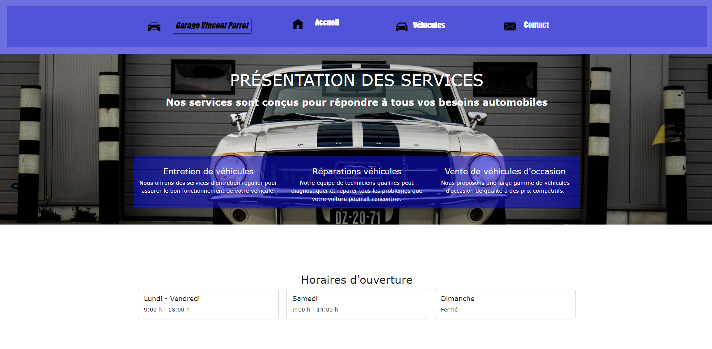
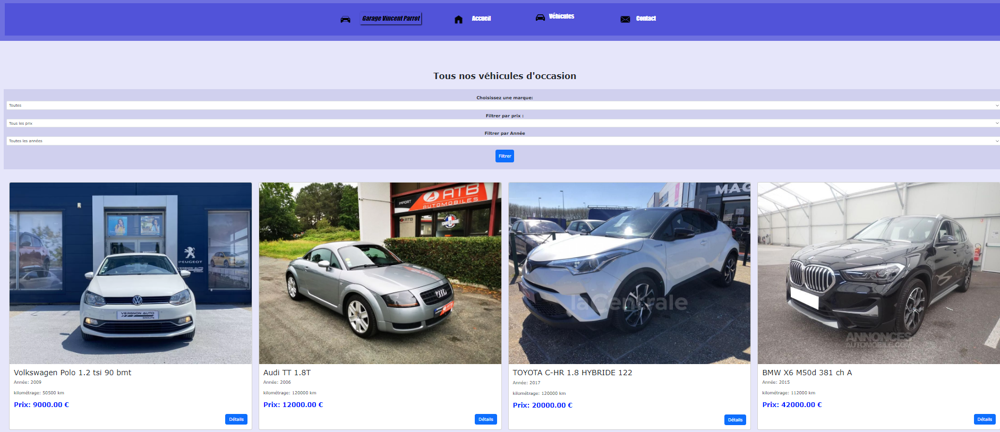
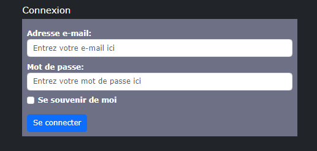

# Concessionnaire Automobile: Garage Vincent Parrot, une Plateforme de Vente de Véhicules en Ligne


## Description

Cette plateforme en ligne permet aux utilisateurs de rechercher, comparer et acheter des véhicules de manière pratique et sécurisée. Notre inventaire propose une gamme de modèles et de marques de voitures pour répondre aux différents besoins de nos clients.


## Fonctionnalités


### Fonctionnalités Générales
- Barre de navigation vers toutes les pages
- Formulaire de connexion et d'authentification (Vérification de la puissance de mot de passe).
 
### Accueil
- Description et Presentation des services et les horaires d'ouverture.
- Afficher et réceptionner les avis des clients.

### Vehicules
- Recherche et filtrage des véhicules par marque, année, prix.
- Afficher les caractéristiques des voitures.
 
### Contact
- Processus d'achat en ligne.
- Réservation de voitures.

## Démonstration 
**lien**: <br> https://juanjosecruzcano.fr/
<br><br><br><br>
 





## Exigences du Projet

Pour exécuter et développer ce projet, les éléments suivants sont nécessaires :

- **Serveur web** Apache
- **PHP** 
- **Serveur MySQL** 
- **XAMPP ou WAMP :** Un environnement de développement web qui comprend un serveur web (Apache), PHP et MySQL. Vous pouvez télécharger XAMPP à partir de [https://www.apachefriends.org/fr/index.html](https://www.apachefriends.org/fr/index.html) ou WAMP à partir de [http://www.wampserver.com/](http://www.wampserver.com/). Suivez les instructions d'installation fournies pour configurer votre environnement de développement.

Assurez-vous d'avoir les versions correctes de ces outils pour éviter toute incompatibilité. Voir le fichier `requirements.txt` ou similaire pour une liste complète des dépendances du projet.

## Instructions d'exécution
### Configuration de la base de données
- Assurez-vous que votre serveur WAMP ou XAMPP est en cours d'exécution et que les services Apache et MySQL sont activés.

- Accédez à l'interface d'administration de votre base de données en utilisant l'URL http://localhost/phpmyadmin/. Cette URL vous permettra d'accéder à phpMyAdmin, une interface graphique pour gérer votre base de données.

- Après avoir configuré votre environnement de développement avec WAMP ou XAMPP, vous devrez mettre à jour les coordonnées de connexion à la base de données dans les fichiers index.php et vehicules.php. Suivez les étapes ci-dessous :

- Ouvrez le fichier `index.php` et `vehicules.php` situé à la racine de votre projet.

- Recherchez la section contenant les informations de connexion à la base de données. Elle pourrait ressembler à ceci : \
```$con = new mysqli("127.0.0.1", "root", "", "concesionario");```

- Importez le fichier SQL fourni `database.sql`  dans votre base de données nouvellement créée. Vous pouvez le faire via l'interface de phpMyAdmin en sélectionnant votre base de données, puis en utilisant l'option d'importation pour charger le fichier SQL.

- Mettez à jour les informations de connexion à la base de données dans votre projet PHP, si nécessaire, pour refléter les paramètres de votre environnement local.
- Suivez les étapes ci-dessous pour exécuter votre projet PHP avec WAMP ou XAMPP :

### Afficher les resultats sur votre navigateur

- Assurez-vous que votre serveur WAMP ou XAMPP est en cours d'exécution. Vérifiez que les services Apache et MySQL sont activés.

- Placez le contenu de votre projet PHP dans le répertoire approprié de votre environnement de développement. Par exemple, dans WAMP, vous pouvez placer les fichiers dans le répertoire www situé dans le répertoire d'installation de WAMP. Dans XAMPP, vous pouvez utiliser le répertoire htdocs situé dans le répertoire d'installation de XAMPP.

- Ouvrez votre navigateur web et accédez à l'URL http://localhost/ pour WAMP ou http://localhost:8080/ pour XAMPP.

- Pour exécuter votre projet PHP, accédez à l'URL correspondant à la structure de fichiers de votre projet. Par exemple, si vous avez un fichier index.php à la racine de votre projet, accédez à http://localhost/index.php.

- Votre projet PHP devrait maintenant s'exécuter dans votre navigateur.


